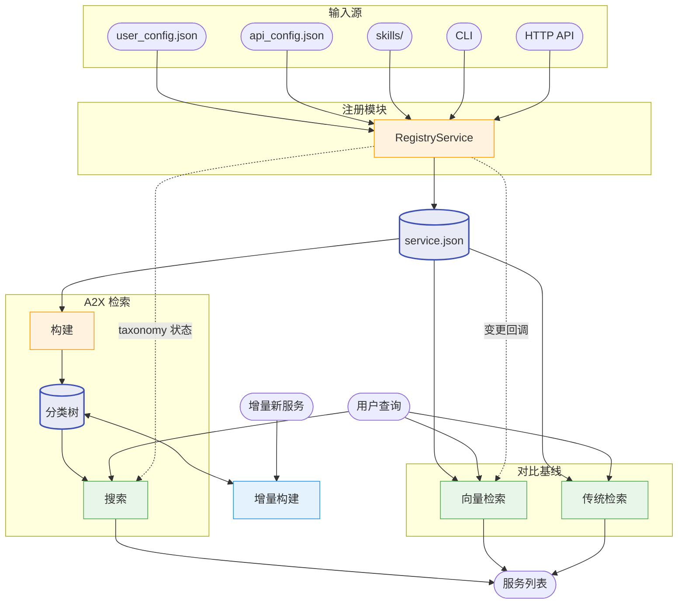
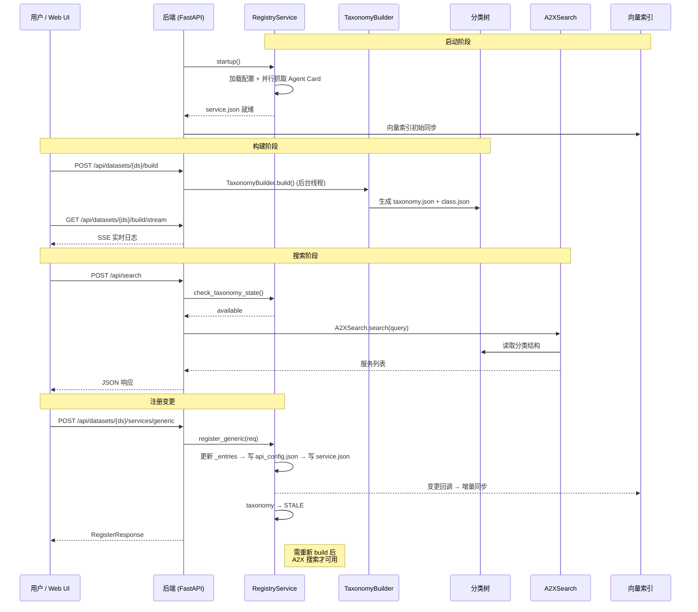
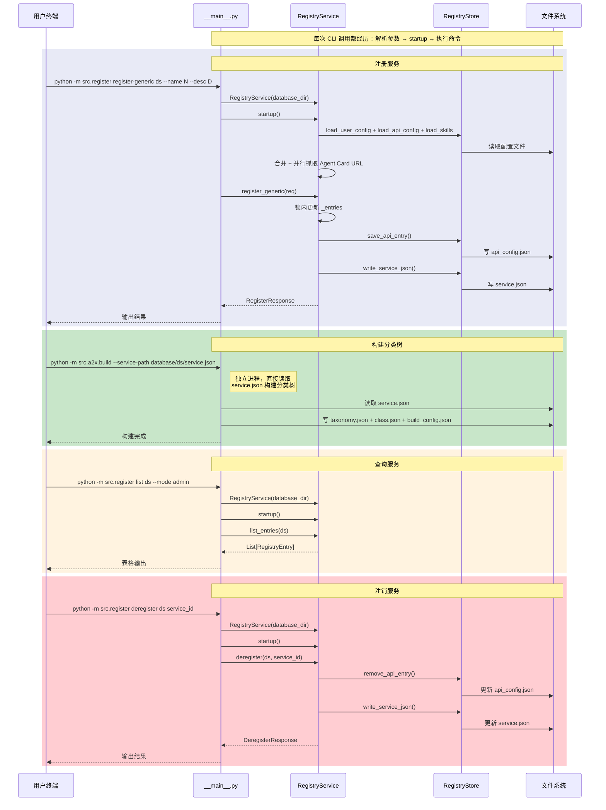
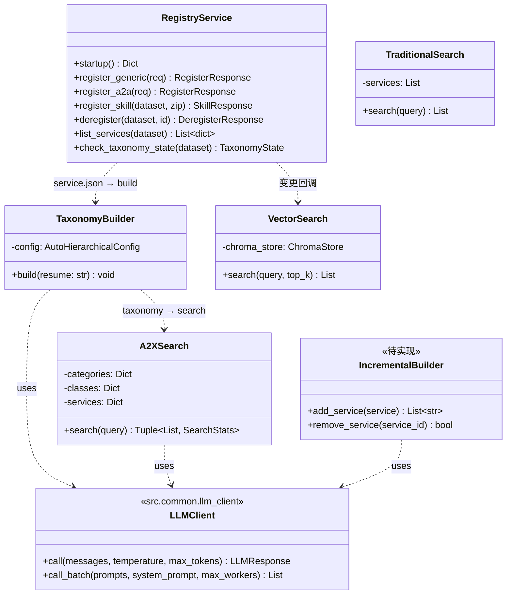

# A2X 系统设计文档

本文档包含系统整体视图。各模块详细设计见：
- 注册模块：[register_design.md](register_design.md)
- 构建模块：[build_design.md](build_design.md)
- 搜索模块：[search_design.md](search_design.md)
- 增量构建模块：[incremental_design.md](incremental_design.md)
- 前端：[frontend_design.md](frontend_design.md)

---

## 系统整体视图

### 1. 流程逻辑说明

A2X Registry 由以下模块组成，围绕核心数据结构 **分类树** 和 **服务注册表** 协同工作：

| 模块 | 职责 | 状态 |
|------|------|------|
| **注册模块** (`src/register/`) | 服务注册/注销/查询，管理三类服务（Generic + A2A + Skill），输出 service.json | ✅ |
| **构建模块** (`src/a2x/build/`) | 从服务列表自动构建层次化分类树 | ✅ |
| **搜索模块** (`src/a2x/search/`) | 基于分类树执行两阶段 LLM 递归检索 | ✅ |
| **增量构建** (`src/a2x/incremental/`) | 将增量新服务插入已有分类树 | 待实现 |
| **向量基线** (`src/vector/`) | ChromaDB 向量检索（对比基线） | ✅ |
| **传统基线** (`src/traditional/`) | MCP 全上下文基线（对比基线） | ✅ |
| **后端** (`src/backend/`) | FastAPI，路由 + 服务编排 | ✅ |
| **前端** (`src/frontend/`) | React + D3.js 可视化 + 管理面板 | ✅ |

**数据流**：
- 注册模块管理服务生命周期 → 输出 service.json → 构建模块、向量基线、传统基线消费
- 构建模块输出分类树（taxonomy.json + class.json）→ 搜索模块使用
- 注册模块检测 service.json 变更 → 通过回调触发向量索引增量同步
- 注册模块跟踪 taxonomy 状态 → 搜索模块查询前检查分类树是否可用

### 2. 对外调用接口

| 模块 | 输入 | 输出 |
|:----:|:----:|:----:|
| **注册** | 配置文件 / HTTP API / CLI | service.json + taxonomy 状态 |
| **构建** | service.json | 分类树（taxonomy.json + class.json） |
| **搜索** | 查询 + 分类树 | 服务列表 + 搜索统计 |
| **增量构建** | 新服务 + 分类树 | 更新后的分类树 |
| **向量基线** | 查询 + service.json | 服务列表 |
| **传统基线** | 查询 + service.json | 服务列表 |

### 3. 逻辑视图



### 4. 顺序图

#### 4a. 远程使用（Web UI / HTTP API → FastAPI 后端）



#### 4b. 本地使用（CLI → 直接调用 Python 接口）



### 5. 类图



### 6. 目录结构

```
src/
├── common/          # 共享工具（models, llm_client, evaluation, naming）
├── a2x/             # A2X 分类树检索（build / search / evaluation / incremental）
├── vector/          # 向量基线（ChromaDB 索引 / search / evaluation）
├── traditional/     # 传统基线（全上下文 search / evaluation）
├── register/        # 服务注册（generic / a2a / skill）
├── backend/         # FastAPI 后端（routers: dataset, build, search, provider）
├── frontend/        # React + Vite + Tailwind + D3.js
└── ui/              # 集成启动器（python -m src.ui）
```
