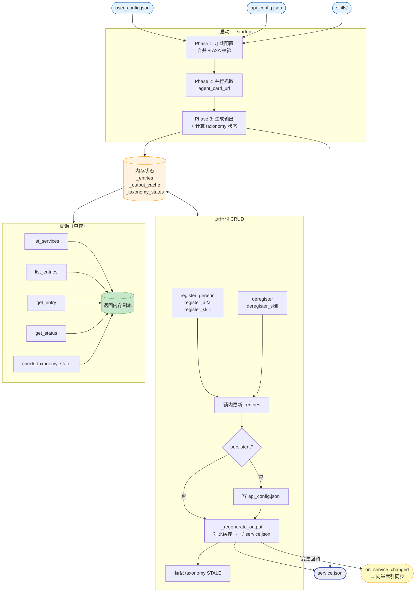
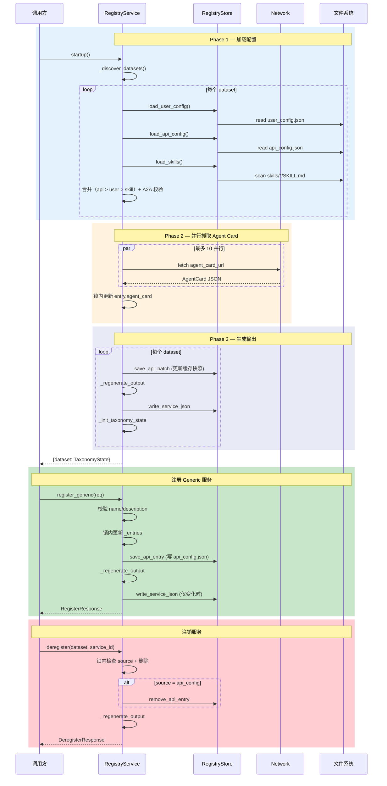
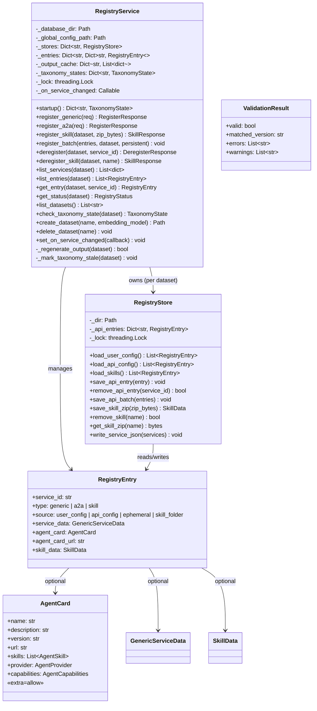

# 注册模块设计文档

本文档详细描述注册模块（`src/register/`）的设计。系统整体视图及其他模块设计见 [a2x_design.md](a2x_design.md)。

---

## 1. 流程逻辑说明

注册模块为 A2X Registry 提供服务注册能力，支持三类服务（Generic + A2A Agent + Skill），多数据集，多种注册入口（本地配置文件 / Python API / CLI / Skill 文件夹）。后端 HTTP API（`src/backend/routers/`）通过调用本模块的 Python 接口实现远程访问。

参考 Nacos 设计思路：分离"注册存储"与"消费输出"，但针对单机文件驱动场景做了简化。

### 核心架构

```
user_config.json ──┐
  (用户编辑，只读)   │
                   ├─→ RegistryService ─→ service.json (纯输出)
api_config.json ───┤       │
  (系统写入)        │       │
skills/*/SKILL.md ─┘  RegistryStore
  (文件夹注册)         (文件 I/O)
```

**设计原则**：

- `service.json` 是**纯输出**，从不被注册模块读取；所有状态来自三个输入源
- 三来源合并优先级：`api_config` > `user_config` > `skill_folder`（同 ID 时高优先级覆盖）
- **锁内只操作内存，文件 I/O 在锁外执行**
- 查询方法返回内存副本，不暴露内部引用

### 启动流程

每次使用前必须调用 `startup()`，按三阶段初始化：

1. **Phase 1 — 加载配置文件**：遍历所有数据集目录，读取 `user_config.json`（只读）+ `api_config.json`（缓存到内存）+ `skills/*/SKILL.md`，合并后验证 A2A 条目
2. **Phase 2 — 并行抓取 Agent Card URL**：对包含 `agent_card_url` 的条目，`ThreadPoolExecutor(10)` 并行抓取，成功后更新缓存快照
3. **Phase 3 — 生成输出**：持久化最新的 api_config 快照，生成 service.json，计算 taxonomy 状态

### 注册流程

```
register_generic / register_a2a:
  → 校验输入（name/description 非空，A2A 格式验证）
  → 创建 RegistryEntry
  → 锁内更新 _entries（status: registered / updated）
  → 锁外持久化写 api_config.json（如 persistent=True）
  → _regenerate_output → 对比内存缓存，变化时写 service.json + 触发回调

register_skill(dataset, zip_bytes):
  → 解压 ZIP → 校验 SKILL.md 含 name + description
  → 存储至 skills/{name}/（已存在则覆盖）
  → 锁内更新 _entries → _regenerate_output
```

### 注销流程

```
deregister(dataset, service_id):
  → 锁内检查 source + 删除 _entries
  → user_config 来源: 拒绝（ValueError）
  → skill_folder 来源: 拒绝（需使用 deregister_skill）
  → api_config: 锁外从文件删除
  → ephemeral: 仅内存删除
  → _regenerate_output

deregister_skill(dataset, name):
  → 锁内删除 _entries
  → 将 skills/{name}/ 移至 removed_skills/{name}/（同名覆盖，非直接删除）
  → _regenerate_output
```

### 变更检测

`_regenerate_output` 每次重新生成 output 列表后与 `_output_cache` 中上次结果做内存对比，仅实际变化时写盘并触发回调。无独立 hash 文件。

### Taxonomy 状态联动

每次 CRUD 操作后将 taxonomy 状态标记为 `STALE`（仅当前状态为 `AVAILABLE` 时）。下次搜索前 `check_taxonomy_state()` 重新对比 service hash 与 `build_config.json` 中的 hash，决定是否可用。

## 2. 对外调用接口

### CLI 入口

```bash
python -m src.register [--database-dir DIR] [--config FILE] [--json] [-v] <command>
```

| 子命令 | 说明 | 示例 |
|--------|------|------|
| `status [--dataset DS]` | 查看注册状态 | `python -m src.register status` |
| `datasets` | 列出所有数据集 | `python -m src.register datasets` |
| `list DATASET [--mode admin\|browse]` | 列出服务 | `python -m src.register list publicMCP` |
| `get DATASET SERVICE_ID` | 查看单个服务 | `python -m src.register get default agent_xxx` |
| `register-generic DATASET --name N --desc D` | 注册 Generic | `python -m src.register register-generic default --name "API" --desc "..."` |
| `register-a2a DATASET (--url U \| --card-file F)` | 注册 A2A | `python -m src.register register-a2a default --url https://...` |
| `register-skill DATASET ZIP` | 上传 Skill | `python -m src.register register-skill default skill.zip` |
| `deregister DATASET SERVICE_ID` | 注销服务 | `python -m src.register deregister default generic_xxx` |
| `deregister-skill DATASET NAME` | 删除 Skill | `python -m src.register deregister-skill default my-skill` |
| `create-dataset NAME [--embedding-model M]` | 创建数据集 | `python -m src.register create-dataset myDS` |
| `delete-dataset NAME [--confirm]` | 删除数据集 | `python -m src.register delete-dataset old --confirm` |

全局选项：`--json` 输出机器可读 JSON；`-v` 启用 DEBUG 日志。

向后兼容旧用法：`python -m src.register --status` / `python -m src.register --config path`。

### Python 接口

```python
from src.register import RegistryService
from src.register.models import RegisterGenericRequest, RegisterA2ARequest

svc = RegistryService(database_dir=Path("database"))
svc.startup()

# 注册
svc.register_generic(RegisterGenericRequest(dataset="ds", name="...", description="..."))
svc.register_a2a(RegisterA2ARequest(dataset="ds", agent_card_url="https://..."))
svc.register_skill("ds", zip_bytes)
svc.register_batch(entries, dataset="ds")

# 注销
svc.deregister("ds", "service_id")
svc.deregister_skill("ds", "skill_name")
svc.get_skill_zip("ds", "name")    # → bytes (ZIP)

# 查询
svc.list_services("ds")         # → List[dict]  (service.json 格式)
svc.list_entries("ds")          # → List[RegistryEntry]  (含 source 信息)
svc.get_entry("ds", "id")       # → Optional[RegistryEntry]
svc.get_status("ds")            # → RegistryStatus
svc.list_datasets()             # → List[str]
svc.check_taxonomy_state("ds")  # → Optional[TaxonomyState]

# 数据集生命周期
svc.create_dataset("name", embedding_model="all-MiniLM-L6-v2")
svc.delete_dataset("name")

# 回调（后端用于触发向量索引同步）
svc.set_on_service_changed(lambda dataset: ...)
```

### 输入输出格式

**输入** — `user_config.json` / `api_config.json`：
```json
{
  "services": [
    {"type": "generic", "name": "Calculator", "description": "Basic arithmetic", "url": "..."},
    {"type": "a2a", "agent_card_url": "https://.../.well-known/agent.json"},
    {"type": "a2a", "agent_card": {"name": "...", "description": "...", "skills": [...]}}
  ]
}
```

**输出** — `service.json`（统一格式 `{id, type, name, description, metadata}`）：
```json
[
  {
    "id": "generic_abc123...", "type": "generic",
    "name": "Calculator", "description": "Basic arithmetic",
    "metadata": {"url": "...", "inputSchema": {...}}
  },
  {
    "id": "agent_def456...", "type": "a2a",
    "name": "Weather Agent", "description": "Provides weather info. Skills: [get_forecast] ...",
    "metadata": {"name": "...", "description": "...", "url": "...", "skills": [...]}
  },
  {
    "id": "skill_789abc...", "type": "skill",
    "name": "algorithmic-art", "description": "Creating algorithmic art...",
    "metadata": {"skill_path": "skills/algorithmic-art", "license": "...", "files": ["SKILL.md", ...]}
  }
]
```

- Generic: `metadata` 含 `url`（可选）和 `inputSchema`（可选）
- A2A: `metadata` 为完整 AgentCard（含非标准字段，`extra="allow"`）；`description` 由 `build_description()` 聚合主描述 + skills
- Skill: `metadata` 含 `skill_path`、`license`、`files`
- 未解析的 A2A（URL fetch 失败且无缓存）：`description` 为 `"Unresolved agent card: <url>"`

### 文件布局

```
database/{dataset}/
    user_config.json    ← 用户手动编辑（系统只读）
    api_config.json     ← HTTP/CLI 注册的持久化服务（系统写入）
    service.json        ← 纯输出（从不作为输入读取）
    skills/             ← Skill 文件夹（每个子目录含 SKILL.md）
    removed_skills/     ← 已注销的 Skill（移动而非删除）
    taxonomy/
        taxonomy.json   ← 分类树结构
        class.json      ← 分类元数据
        build_config.json ← 构建参数 + service_hash
```

| 文件 | 谁写 | 谁读 | 用途 |
|------|------|------|------|
| `user_config.json` | 用户 | 系统（启动时） | 用户声明的服务 |
| `api_config.json` | 系统 | 系统（启动时 + 运行时） | HTTP/CLI 注册的持久化服务 |
| `skills/*/SKILL.md` | 用户/系统 | 系统（启动时 + 运行时） | Skill 文件夹注册源 |
| `removed_skills/` | 系统 | — | 已注销 Skill 的归档 |
| `service.json` | 系统 | A2X / 向量搜索 | 合并后的输出 |
| `build_config.json` | 构建模块 | 注册模块 | 含 `service_hash` 用于 taxonomy 状态判断 |

## 3. 逻辑视图



## 4. 顺序图

### 启动 + 注册 + 注销



## 5. 类图



## 6. 三类服务

### Generic 服务

```json
{"type": "generic", "name": "Calculator", "description": "Basic arithmetic", "inputSchema": {...}, "url": "..."}
```

- `url` 和 `inputSchema` 均可选
- `service_id` 自动生成：`generic_{sha256(name)[:16]}`

### A2A Agent

**完整 AgentCard**：
```json
{"type": "a2a", "agent_card": {"name": "...", "description": "...", "skills": [...]}}
```

**URL 引用**（系统抓取并缓存快照到 api_config.json）：
```json
{"type": "a2a", "agent_card_url": "https://.../.well-known/agent.json"}
```

- `service_id` 自动生成：`agent_{sha256(name)[:16]}`
- AgentCard 模型使用 `extra="allow"`，非标准字段完整保留
- 格式验证支持 v0.0（最宽松）和 v1.0（完整 A2A 规范），先严后宽匹配

### Skill

以文件夹存储在 `skills/{name}/`，每个文件夹必须包含 `SKILL.md`：

```yaml
---
name: algorithmic-art
description: Creating algorithmic art using p5.js...
license: Complete terms in LICENSE.txt
---
```

- 注册：ZIP 上传或直接放入 `skills/` 目录
- 注销：文件夹移至 `removed_skills/`（而非删除）
- `service_id` 自动生成：`skill_{sha256(name)[:16]}`

## 7. A2A 格式验证

| 版本 | 必填字段 | 用途 |
|------|---------|------|
| **v0.0** | name, description | 兼容非标准 Agent Card |
| **v1.0** | name, description, version, url, capabilities, defaultInputModes, defaultOutputModes, skills (含 id/name/description/tags) | 完整 A2A v1.0 规范 |

- 验证顺序：**先严后宽**（v1.0 → v0.0），返回最严格的匹配版本
- 默认允许 `{"v0.0", "v1.0"}`，可通过 `allowed_a2a_versions` 配置

## 8. Taxonomy 状态 (TaxonomyState)

| 状态 | 含义 |
|------|------|
| `available` | service hash 与 `build_config.json` 一致，A2X 搜索可用 |
| `unavailable` | hash 不一致，A2X 搜索被阻断 |
| `stale` | CRUD 发生后尚未重新检查，下次查询时重新评估 |
| `nonexistent` | 尚未构建分类树（或 `build_config.json` 不存在） |
| `None`（返回值） | 该数据集不受注册模块管理，不做限制 |

状态由 `check_taxonomy_state()` 计算：读取 `build_config.json` 中的 `service_hash`，与当前 service 列表的 hash（name+description 对的 SHA256）对比。每次 CRUD 后置为 `STALE`（仅当前为 `AVAILABLE` 时），下次搜索前重新评估。

## 9. 线程安全

```
RegistryService._lock
  └── 保护: _entries, _output_cache, _taxonomy_states

RegistryStore._lock
  └── 保护: _api_entries + api_config.json 写入
```

- `_do_register`：锁内更新 `_entries` → 锁外写 `api_config.json` → 锁外 `_regenerate_output`
- `deregister`：锁内删除 + 记录 source → 锁外删除 `api_config` 条目 → 锁外 `_regenerate_output`
- `_regenerate_output`：锁内生成 output + 对比缓存 → 锁外写文件 + 触发回调
- `_fetch_agent_cards_parallel`：并行 fetch 后在锁内更新 `entry.agent_card`
- 查询方法（`list_services` 等）返回副本，不暴露内部引用

## 10. 向量数据库同步

注册模块与向量搜索引擎通过**回调**解耦：

```python
registry_svc.set_on_service_changed(callback)
# callback: (dataset: str) -> None
```

每次 `_regenerate_output` 检测到 service.json 实际变更后，触发回调。后端注册该回调为 `search_service.schedule_vector_sync(dataset)`，在独立线程中做增量同步（upsert 新增/变化条目，删除已注销条目）。

## 11. 模块结构

```
src/register/
    __init__.py          导出 RegistryService, RegistryStore, validate_agent_card
    models.py            Pydantic 数据模型（RegistryEntry, AgentCard, Request/Response 等）
    store.py             RegistryStore: 单数据集文件 I/O（线程安全）
    service.py           RegistryService: 多数据集业务编排（单锁保护所有状态）
    agent_card.py        Agent Card URL 抓取 + description 聚合
    validation.py        A2A 格式校验（v0.0 / v1.0）
    __main__.py          CLI 入口（11 个子命令 + 向后兼容旧用法）
```

## 12. 效率

| 场景 | 文件写入 | 说明 |
|------|---------|------|
| 启动 | 每数据集 1~2 次 | service.json 必写（_output_cache 初始为空）+ api_config 快照（如有 api_config 条目） |
| 单次持久注册 | 2 次 | api_config + service.json |
| 单次临时注册 | 0~1 次 | 仅 service.json（如内容变化） |
| 批量 N 个 | 2 次 | 不是 N 倍（单次 api_config + 单次 service.json） |
| 查询 | 0 次 | 直接返回内存缓存副本 |
